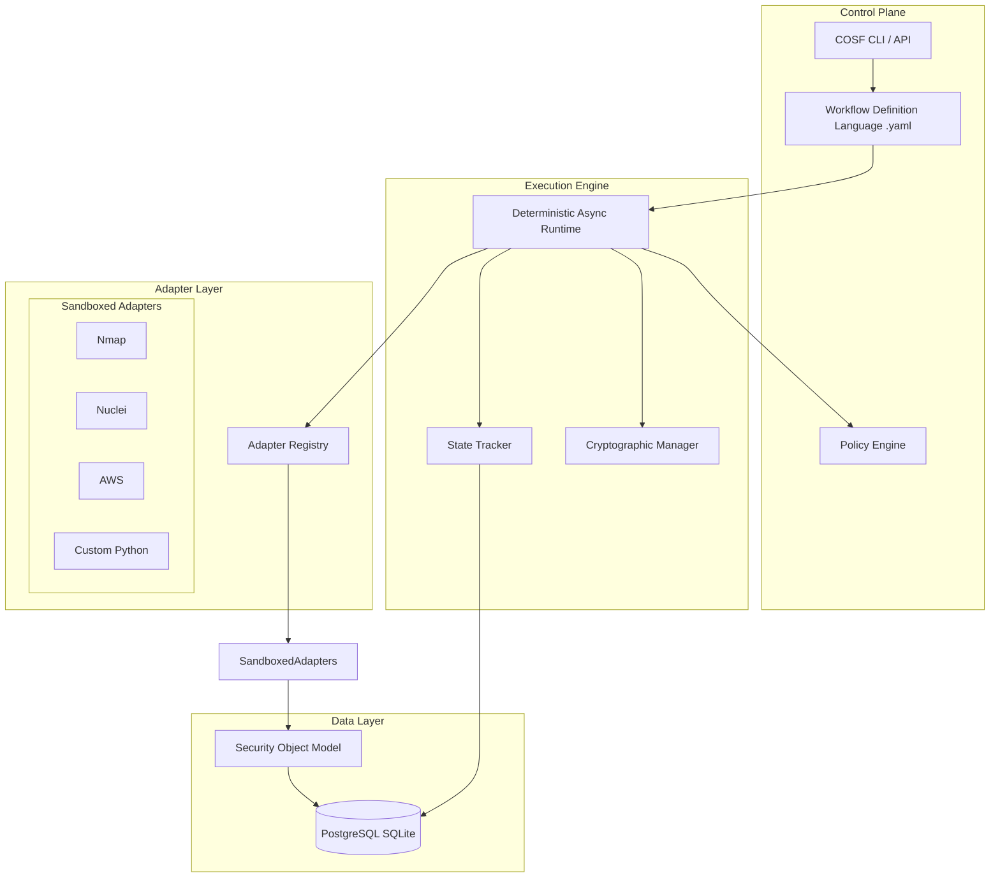

# Cyber Operations Standardization Framework (COSF)

The **Cyber Operations Standardization Framework (COSF)** is a universal execution, orchestration, and data normalization layer for cybersecurity operations. It aims to establish a "Security-as-Code" standard by making security workflows executable, portable, and reproducible.

## The Problem

Today's cyber tools are powerful but fragmented. Security engineers rely on multiple independent tools with incompatible outputs and unstructured execution methodologies. There is no universal operational layer.

## The Solution

COSF introduces a standardized abstraction layer:
1.  **Workflow Definition Language (WDL):** Declaratively define security tasks, creating executable playbooks.
2.  **Tool Adapter Layer:** Execute various tools (Nmap, Nuclei, AWS CLI, etc.) within sandboxed environments.
3.  **Data Normalization (SOM):** Convert heterogeneous tool outputs into a unified Security Object Model.
4.  **Execution Engine:** A deterministic runtime that handles dependencies, policies, conditional logic, and cryptographically signs outputs for auditability.

---

## 🏗 High-Level Architecture



## 🚀 Quickstart

**Requirements:** Python 3.12+, Docker (for sandboxed tools)

1.  **Install:**
    ```bash
    pip install -e .
    ```
2.  **Run a workflow:**
    ```bash
    cosf run assessment.yaml
    ```
3.  **View execution logs/results:**
    ```bash
    # Command coming soon in CLI
    ```

## 📖 Documentation

*   [System Architecture (`docs/ARCHITECTURE.md`)](docs/ARCHITECTURE.md)
*   [Workflow Definition Language (`docs/WORKFLOW_LANGUAGE.md`)](docs/WORKFLOW_LANGUAGE.md)
*   [Security & Non-Repudiation Model (`docs/SECURITY_MODEL.md`)](docs/SECURITY_MODEL.md)

## Current Features
*   [x] WDL Parser (YAML)
*   [x] Async Dependency Execution Graph
*   [x] Sandboxed Adapters (Docker-based)
*   [x] Output Normalization (Nmap, AWS, Metasploit, etc.)
*   [x] Security Policy Engine (Plan and Dynamic Task Verification)
*   [x] Cryptographic Integrity (Ed25519 Signed Tasks & Executions)
*   [x] Parameter Injection and Context Sharing
