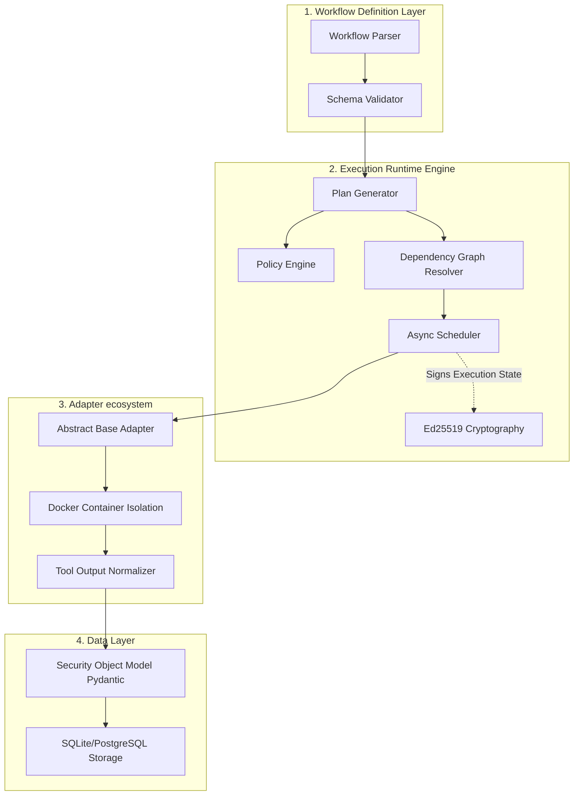
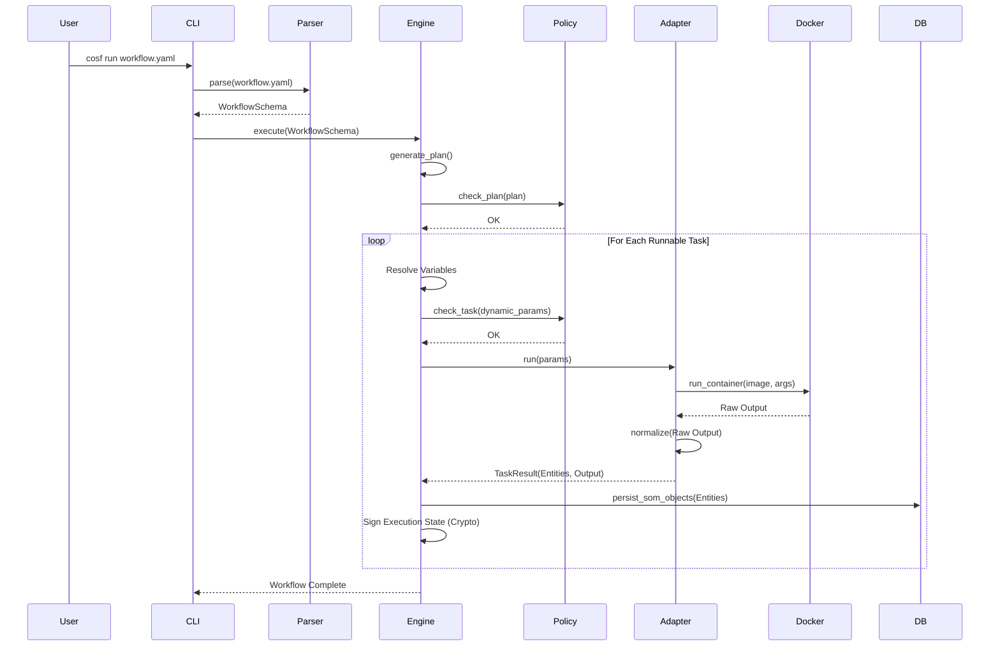

# COSF System Architecture

The Cyber Operations Standardization Framework (COSF) is designed to decouple security operations from specific tools. It functions as a runtime orchestrator that translates declarative intents into secure, auditable, and tool-agnostic operations.

## Architecture Layers

## Component Details

### 1. Workflow Definition Language (WDL) Parser
Located in `cosf/parser/`. Parses `.yaml` workflows into strict Pydantic `WorkflowSchema` and `WorkflowTask` objects. Hard fails on invalid schemas to guarantee "Shift-Left" predictability.

### 2. Execution Engine (`cosf/engine/runtime.py`)
Built on Python's `asyncio`.
*   **Dependency Resolution:** Creates an execution graph based on `depends_on`.
*   **Condition Evaluator:** Evaluates `when` clauses to conditionally execute or skip tasks dynamically based on previous task outputs (e.g., `{{ tasks.recon.outputs.target_ip }} == "192.168.1.1"`).
*   **State Management:** Stores running state into a relational DB via SQLAlchemy async sessions.

### 3. Tool Adapters (`cosf/engine/adapters/`)
Implements the `BaseAdapter` interface. 
*   **Sandboxing:** Every third-party tool execution is instantiated inside a temporary Docker container via the Python `docker` SDK to ensure isolation.
*   **Normalization:** Receives heterogeneous outputs (e.g., XML from Nmap, JSON from Nuclei) and forces them into strictly typed `SOM` objects.

### 4. Security Object Model (SOM) (`cosf/models/som.py`)
A generalized abstraction of security data. Entities include `Asset`, `Service`, `Vulnerability`, `Credential`, `AttackStep`, `Evidence`, and `Relationship`. Models map cleanly to industry ontologies like MITRE ATT&CK.

## Execution Sequence

